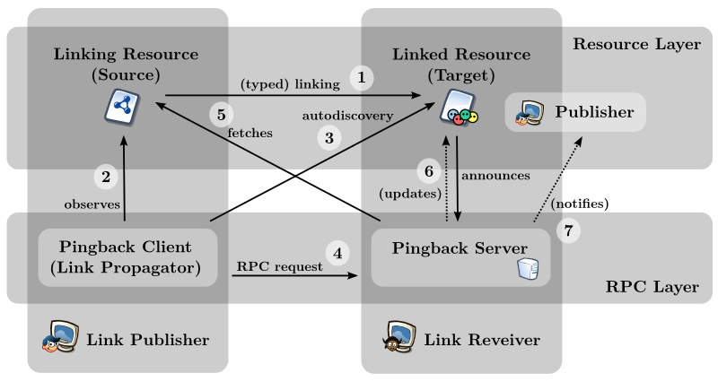

The Semantic Pingback mechanism is an extension of the well-known Pingback method, a technological cornerstone of the blogosphere, thus supporting the interlinking within the Data Web.

* [Project Page @ aksw.org](http://aksw.org/Projects/SemanticPingback.html)
* [Semantic Pingback Vocabulary](https://github.com/AKSW/SemanticPingback)
* [Semantic Pingback Server](https://github.com/AKSW/SemanticPingback-Server) (an example implementation)

*This page was moved from our old wiki and still contains links to the old google code repository. Sorry*

## Overview

Semantic Pingback tackles the *quality*, *timeliness* and *coherence* as well as *direct end user benefits* of the emerging Linked Data Web. Semantic Pingback extends the well-known [Pingback](http://www.hixie.ch/specs/pingback/pingback) method, which is technological cornerstone of the blogosphere. It is based on the advertising of an RPC service for propagating typed RDF links between Data Web resources. It is downwards compatible with conventional Pingback implementations, thus allowing to connect and interlink resources on the Social Web with resources on the Data Web.

  1. A *linking resource* (depicted in the upper left) links to another (Data) Web resource, here called *linked resource*. The linking resource can be either an conventional Web resource (e.g. wiki page, blog post) or a Linked Data resource. Links originating from Linked Data resources are always typed (based on the used property), links from conventional Web resources can be either untyped (i.e. plain HTML links) or typed (e.g. by means of RDFa annotations).
  2. The *Pingback client* (lower left) is either integrated into the data/content management system or realized as a separate service, which observes changes of the Web resource.
  3. Once the establishing of a link was noted, the Pingback client tries to autodiscover a Pingback server from the linked resource.
  4. If the autodiscovery was successful, the respective Pingback RPC server is called, with the parameters linking resource (i.e. source) and linked resource (i.e. target).
  5. In order to verify the retrieved request (and to obtain information about the type of the link in the semantic case), the Pingback server fetches (or dereferences) the linking resource.
  6. Subsequently, the Pingback server can perform a number of actions, such as updating the linked resource (e.g. adding inverse links) or notifying the publisher of the linked resource (e.g. via email).

## XML/RPC vs. Simplified Post Request
While the Pingback 1.0 specification defines a XML/RPC call for request a pingback on a Pingback Server, [we discussed a simplified request representation](http://lists.foaf-project.org/pipermail/foaf-protocols/2010-April/) using only HTTP-post attributes.

The simplified pingback post request has two obligatory and one optional post parameter:

  * **source** is the source resource URI (obligatory)
  * **target** is the target resource URI (obligatory)
  * **comment** is an optional comment for the pingback request given by the source owner or the source owners application.

To distinguish these two request methods, the pingback vocabulary defines two different object properties: [pingback:service](http://purl.org/net/pingback/service) (XML/RPC) and [pingback:to](http://purl.org/net/pingback/to) (Simplified Post Request). Both properties can be used to link a pingback target resource with its pingback server.

## Available Implementations

We implemented the Semantic Pingback mechanism in three different scenarios:

  * Semantic Pingback server and client functionality is available for [OntoWiki](http://aksw.org/Projects/OntoWiki).
  * Semantic Pingback server functionality was integrated in [Triplify](http://aksw.org/Projects/Triplify), thus supporting the interlinking with relational data on the Data Web.
  * A prototype of a standalone Semantic Pingback server was implemented in PHP, that can be utilized with arbitrary resources that do not provide a Pingback service themselves.

### OntoWiki

In order to enable the Semantic Pingback extension for [OntoWiki](http://aksw.org/Projects/OntoWiki) you need to make sure that

  * the Linked Data plugin is enabled (should be enabled by default, `extensions/plugins/linkeddata`),
  * the Pingback plugin (`extensions/plugins/pingback`) is enabled and
  * the Pingback component (`extensions/components/pingback`) is enabled.

The plugin and component can be enabled by simply renaming the `plugin.ini-dist` respectively `component.ini-dist` to `plugin.ini` respectively `component.ini`.

### Triplify
A pingback-enabled version of Triplify will be released soon.

### Standalone Semantic Pingback Server
A prototype of a standalone Semantic Pingback server is [available for download here](https://github.com/AKSW/SemanticPingback-Server).

To setup the Semantic Pingback server follow these steps:

  1. Copy the contents of the folder in a Web application directory on your Web server.
  2. Copy the distributed configuration file (`config.inc.php-dist`) to `config.inc.php`. Open the file in a text editor and adjust the settings to fit your configuration. At least a valid database connection needs to be supplied. If you want to use the mail feature, make sure that your PHP environment is configured correctly to be able send emails.
  3. Congratulations! Your Semantic Pingback is ready to receive Pingbacks now. You should now start propagating the URL of the service. If you place the files in a directory like `<Web-Root>/pingback/` and the `index.php` file is located in `<Web-Root/pingback/index.php`, your server is available through the URL `http://example.org/pingback/` (where `example.org` should be replaced with your domain).

Your `config.inc.php` file should look as follows:

    # Database configuration
    ###############################################################################
    $config['db'] = mysql_connect('localhost', 'myusername', 'mypassword');
    mysql_select_db('mypingbackdatabase');

    # Target configuration
    ###############################################################################
    # Set to true if target URIs outside the namespace of the domain are allowed
    $config['target_allow_external'] = false;

    # Mail configuration
    ###############################################################################
    $config['mail_send'] = true;
    $config['mail_copyToSource'] = false;
    $config['mail_linkColor'] = '#07c';
    $config['mail_highlightColor'] = '#07c';
    $config['mail_from'] = 'AKSW Semantic Pingback Service <noreply@informatik.uni-leipzig.de>';
    #$config['mail_to'] = 'me@example.org';
    $config['mail_senderName'] = 'Agile Knowledge Engineering and Semantic Web (AKSW)';
    $config['mail_subject'] = 'Semantic Pingback';
    $config['mail_bye'] = 'Yours, AKSW';

    # Mail templates
    ###############################################################################
    $config['mail_templates'] = array();
    $config['mail_templates']['generic'] = 'generic';
    #$config['mail_templates']['http://xmlns.com/foaf/0.1/knows'] = 'foaf_knows';

{{a name="usagefoaf"}}

### AKSW Semantic Pingback service

If you do not want to provide a Pingback service on your own, you can use the [AKSW Semantic Pingback Service](http://pingback.aksw.org). If a pingback-enabled client then detects the usage of your pingback-enabled resource, our service notifies you via email.

In order to use the service for one of your resources (e.g. a [FOAF](http://xmlns.com/foaf/spec/) profile) you can propagate the use of the AKSW Semantic Pingback service in two ways:

  1. Return a `X-Pingback: http://pingback.aksw.org/` HTTP header field, when your resource is requested. This solution is downward compatible with the conventional Pingback mechanism, since this method is part of the autodiscovery process. On a apache webserver, you could create a `.htaccess` file with the following code: `Header set X-Pingback "http://pingback.aksw.org/"`.
  2. Embed a `http://purl.org/net/pingback/service` statement into your FOAF profile, that links your WebID with the URL of the service (see example below). This solution only works with Semantic Pingback clients, since this autodiscovery mechanism is not included in the original Pingback specification.

    <foaf:Person rdf:about="http://example.org/foaf.rdf#me">
       <pingback:service rdf:resource="http://pingback.aksw.org" />
    </foaf:Person>

## How to add Semantic Pingback functionality to your application
If you plan to implement the Semantic Pingback mechanism, you should generally follow the conventional [Pingback specification](http://www.hixie.ch/specs/pingback/pingback), since Semantic Pingback is downward compatible with the original Pingback method. We will focus in this section on the differences.

### Semantic Pingback Client
One basic design principle of the original Pingback specification is to keep the implementation requirements of a Pingback client as simple as possible. Consequently, Pingback clients to not even need an XML/HTML parser for basic functionality. There are three simple actions to be followed by a Pingback client:

  1. Determine suitable links to external target resources,
  2. detect the Pingback server for a certain target resource (autodiscovery) and
  3. send an XML-RPC post request via HTTP to that server.

The only modification to the client behavior is an additional autodiscovery method for Linked Data resources which is based on RDF and integrates better with Semantic Web technologies. We defined an OWL object property `http://purl.net/pingback/service`, which is part of the Pingback namespace and links a RDF resource with a Pingback XML-RPC server URL. Consequently, a Semantic Pingback client should (if no `X-Pingback` HTTP header field is available) try to fetch an RDF representation of the target resource and check for a `pingback:service` statement.

### Semantic Pingback Server
We did not touch the XML-RPC interface, but a Semantic Pingback server should handle Pingback requests different than conventional Pingback servers would handle them. We describe some guidelines in terms of backlinking, spam prevention and provenance tracking.

#### Backlinking
The idea behind propagating links from the publisher of the source resource to the publisher of the target resource is to automate the creation of backlinks. In pingback-enabled blogging systems, for example, a backlink is rendered in the feedback area of a target post together with the title and a short text excerpt from the source resource.

To retrieve all required information from the source resource (e.g. in order to verify links), a Semantic Pingback server should:
  1. Try to obtain an RDF representation by requesting RDF with respective HTTP `Accept` header.
  2. If this is not possible, try to obtain RDF by employing an RDFa parser.
  3. If this fails, check for an untyped (X)HTML link in the body of the source resource.

Depending on the type of data which was retrieved from the source resource, the server can react as follows:
  * If there is only an *untyped* (X)HTML link in the source resource, this link can be added as RDF triple with a generic RDF property (e.g. `dc:references`, `sioc:links_to`) to the servers knowledge base.
  * If there is at least on *direct link* from the source resource to the target resource, this triple should be added to the servers knowledge base.
  * If there is any other triple in the source resource where either the subject or the object of the triple corresponds to the target resource, the target resource can be linked to the source resource using the `rdfs:seeAlso` property.

In addition to the statements which link the source and the target resource, metadata about the source resource (e.g. a label and a description) can be stored as well.

#### Spam Prevention
The Semantic Pingback mechanism prevents spamming by fetching the linking resource and checking for the existence of a valid incoming link or an admissible assertion about the target resource. E.g.:
  * *Information analysis.* The Pingback server can, for example, dismiss assertions which have logical implications (such as domain, range or cardinality restrictions), but allow label and comment translations into other languages.
  * *Publisher relationship analysis.* E.g. based on the trust level of the publisher of the linking resource. A possibility to determine the trust level is to resolve `foaf:knows` relationships from the linked resource publisher to the linking resource publisher.

#### Provenance Tracking
Provenance information can be recorded using the [provenance vocabulary](http://trdf.sourceforge.net/provenance/ns.html).

## Further Information
Please have a look at our paper:

Sebastian Tramp, Philipp Frischmuth, Timofey Ermilov, Sören Auer: [Weaving a Social Data Web with Semantic Pingback](http://www.informatik.uni-leipzig.de/~auer/publication/SemanticPingback.pdf)

Also the original [Pingback specification](http://www.hixie.ch/specs/pingback/pingback) provides additional information.
